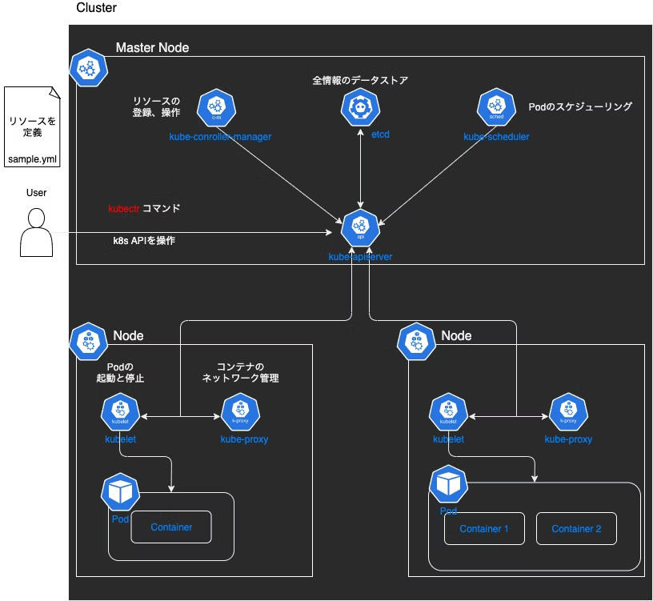

# Kubernetes

## 目次

## はじめに
### kubernetesとは？
コンテナ化されたアプリケーションを宣言的に管理し、デプロイ・スケーリング・自己修復を自動化するオーケストレーションプラットフォーム

メリットとして
- 大量のコンテナをコードで管理することができる
- デプロイの自動化
- 高可用性
  podという最小単位で構成される。Deploymentがpodを増減させる事で可用性を高めることができる


### kubernetes概要
クラスターにどんな状態になっていて欲しいかをyamlで定義する。<br>
yamlをKubernetes APIに読み込ませてリソースを作成する。<br>



#### 用語集
1. Kubernetesのコンポーネント

| 種類                    | 機能                                                      |
| ----------------------- | --------------------------------------------------------- |
| kube-apiserver          | kubectlコマンドの受け口。リソースの登録や削除を受け付ける |
| etcd                    | リソースの情報を保存する                                  |
| kube-scheduler          | podをどのノードに置くかを決める                           |
| kube-controller-manager | クラスタの状態を常にチェックして、理想の状態に調整        |
| kubelet                 | 各ノード上でPodを起動・監視する                           |
| kube-proxy              | Serviceのルールに基づいてネットワーク転送を設定           |
| Container Runtime       | コンテナの実行エンジン                                    |

2. リソース
   状態を宣言する対象（最終的にどうなっていてほしいか（Desired State）をユーザが定義する）

| 種類                    | 機能                                                   |
| ----------------------- | ------------------------------------------------------ |
| Deployment              | Podを何個どう管理するかのルール                        |
| ReplicaSet              | 同じ仕様のPodを複数生成・管理する                      |
| Service                 | podへのアクセスルール                                  |
| pod                     | 実際に動くコンテナの集まり                             |
| HorizontalPodAutoscaler | CPUやメモリの使用率に応じてreplica数を自動的に調整する |

1. 関連用語

| 単語                   | 意味                                                                         |
| ---------------------- | ---------------------------------------------------------------------------- |
| クラスタ               | kubernetesのリソースを管理する一番大きい単位                                 |
| Control Plane          | クラスタに関する全体的な決定をするノード（スケジューリングやリソースの管理） |
| Node（ワーカーノード） | 実際のPodを実行する計算リソース                                              |


## とりあえず動かしてみる

[参考にしたページ](https://qiita.com/tomoyafujita/items/5a3c06705f62c5732bc5)<br>
[参考にしたページ２](https://qiita.com/dsagnlaiweudlbfna/items/55b162197afa74306067)

1. docker のインスト―ル　[公式](https://docs.docker.com/engine/install/ubuntu/#install-using-the-repository)
2. Kubernetesをインストール　[公式](https://kubernetes.io/ja/docs/tasks/tools/install-kubectl-linux/#install-kubectl-binary-with-curl-on-linux)
3. kindをインストール　[公式](https://kind.sigs.k8s.io/docs/user/quick-start/#:~:text=exe%24PATH-,Linux%20%E3%81%AE%E5%A0%B4%E5%90%88%3A,-%23%20For%20AMD64%20/%20x86_64)

4. kindのコマンドを実行<br>
   ```bash 
   kind create cluster
   ```
   上記コマンドを実行すると
   1. dockerを使ってKubernetesクラスタを作成
      デフォルトでは１ノード（Control-plane ノード）が生成される
   2. Kubernetesクラスタを初期化
      内部でControl-planeの４つのコンポーネントをセットアップしている
      - kube-apiserver：kubectlコマンドの受付
      - kube-scheduler：podの配置を決める
      - kube-controller-manager：クラスターの監視。podを増やしたりする
      - etcd：クラスターの状態を保存する
   3. kubeconfigを生成
      クラスタの情報（APIサーバのアドレスなど）を含む設定ファイルを作成してくれる
   が行われる

   docker ps コマンドで確認すると、コンテナが動いている<br>
   

5. クラスターが正しく動いているか確認
   ```bash
   kubectl cluster-info --context kind-kind
   ```
   <br>
   DNSがちゃんと動いてるか（Kubernetesクラスタ内のpodやservice間の内部リソースの通信）<br>
   APIサーバのアドレスが確認できる

6. クラスタを削除する
```bash
kind delete cluster
```

## 複数のノードを動かしてみる
「実際に動かしてみる」ではcontrol-planeが作っただけ。
ここではマルチノードのクラスタを作成してみる。

1. クラスタを設計する(kindが読み込む)
   multi.yaml
```yaml
kind: Cluster
#kindの設定ファイルのバージョン 
apiVersion: kind.x-k8s.io/v1alpha4
#クラスタ内のノード構成を定義するセクション 
nodes: 
- role: control-plane
#アプリケーションの Pod が実行されるノード
- role: worker 
- role: worker

```

2. 作成したクラスタ設計からKindでクラスタを作成する
```bash
kind create cluster --config=multi.yaml
```
上記コマンドを実行するとyamlをもとにクラスターが作成される。<br>
<br>

docker ps コマンドを実行するとcontrol-plane,worker,workerの3つのコンテナが作成されているのがわかる<br>
<br>

```bash
kubectl get nodes -o wide
```
を実行するとクラスタ内のノードの情報を取得できる。
<br>

3. クラスタを削除する
```bash
kind delete cluster
```

### workerノードにアプリをデプロイしてみる
1. クラスタを設計する
```yaml
kind: Cluster
apiVersion: kind.x-k8s.io/v1alpha4
nodes:
- role: control-plane
#ホストの30070ポートをcontrol-planeの30080ポートにポートフォワーディングする
  extraPortMappings:
  - containerPort: 30080
    hostPort: 30070
- role: worker
- role: worker
```

2. アプリの理想状態を設計する（kubernetesが読み込む）

   ####　書き方
      - apiversion
         kubernetesは色んな種類のリソースをAPIグループと呼ばれるカテゴリごとに管理している
         使うリソース毎に対応するapiversionを指定する
      - kind
          使うリソースの種類
          Kubernetes に「何を作りたいのか」を伝えるキーワード
      - metadata
          リソースの名前やラベルなどの管理に使う情報を付与する
      - spec
         　リソースがどんな状態になってほしいかの定義
      - replicas
            作りたいPodの数（希望する状態）
      - selector
            どのpodをこのDeploymentの管理対象にするか
      - template
            podの設計図 
            多くの場合1podにつき1containerだが、複数のコンテナにすることも可能
```yaml
apiVersion: apps/v1
kind: Deployment
metadata:
  labels:
    app: web-nginx
  name: web-nginx
spec:
  replicas: 3
  selector:
    matchLabels:
      app: web-nginx
  template:
    metadata:
      labels:
        app: web-nginx
    spec:
      containers:
      - image: nginx
        name: nginx
        #ポート80で待ち受け
        ports:
        - containerPort: 80
---
apiVersion: v1
#　podへのアクセスを定義
kind: Service
metadata:
  name: web-nginx
spec:
  selector:
    app: web-nginx
  type: NodePort
  ports:
    - port: 80
      nodePort: 30080
```
3. リソースの作成とアプリのデプロイ
```bash
kind create cluster --config=multi_deploy_app.yaml
kubectl create -f app-nginx.yaml
# 既存のリソースがある場合はapply.createは同じリソースが存在するとエラーになる
(kubectl apply -f app-nginx.yaml)　

```

4. 起動の確認
   クラスター内に作成したノードを確認
   ```bash
   kubectl get nodes
   ```
  <br>

  podがどのノードに配置されたのか確認
  ```bash
  kubectl get pods -o wide
  ```
   <br>
   
   上記の結果を見ると、ノードは2つ用意したが3つのpodが1つのノードに偏ってしまっている。
   これはkubernetesのスケジューラがノードの空きリソースを見て判断している。
   podを増やすか、処理負荷が高ければ2つ目のノードに割り当てられる。
   以下のように記述すれば、特定のノードにpodを配置することも可能
   ```yaml
   spec:
      nodeSelector:
         kubernetes.io/hostname: kind-worker2
   ```
5. kubernetesの動きを確認
   以下のコマンドでpodの1つを強制的に削除してみる。
   ```bash
   kubectl delete pod web-nginx-7dddb77876-xqsjj
   ```
   podを確認してみると、削除直後のステータスはContainerCreatingになる。
   しばらくするとRunningになり無事に起動できた。
   Deploymentがpodが2つしか起動してないことを検知してdesired stateを維持するためにpodを起動させた

6. クラスタを削除する
```bash
kind delete cluster
```

### アクセス数に応じてpodをスケーリングさせる
HPA(Horizontal Pod Autoscale)を用いることで実現可能
ディフォルトではmetrics-serverが軽量化のためインストールされていないのでインストールする必要がある

1. アプリの理想状態を設計する
   以下のyamlでDeployment、service、HorizontalPodAutoscalerを定義する
   要約すると
   -  アプリをデプロイ
   -  外部からアクセスできるように設定
   -  CPUの使用率に応じて自動スケールするように設定


   ```yaml
   apiVersion: apps/v1
   kind: Deployment
   metadata:
     name: web-nginx
   spec:
     replicas: 1
     selector:
       matchLabels:
         app: web-nginx
     template:
       metadata:
         labels:
           app: web-nginx
       spec:
         containers:
           - name: app
             image: registry.k8s.io/hpa-example
             ports:
               - containerPort: 80
             resources:
               requests:
                 cpu: "200m"
               limits:
                 cpu: "1"
   ---
   apiVersion: v1
   kind: Service
   metadata:
     name: web-nginx
   spec:
     type: NodePort
     selector:
       app: web-nginx
     ports:
       - port: 80
         targetPort: 80
         nodePort: 30080
   ---
   apiVersion: autoscaling/v2
   kind: HorizontalPodAutoscaler
   metadata:
     name: web-nginx
   spec:
     scaleTargetRef:
       apiVersion: apps/v1
       kind: Deployment
       name: web-nginx
     minReplicas: 1
     maxReplicas: 5
     metrics:
       - type: Resource
         resource:
           name: cpu
           target:
             type: Utilization
             averageUtilization: 50
   ```
2. アプリをデプロイする
   リソースは作成済みなので、差分の更新でよい
   ```bash
      # 1) kindクラスタ作成
      kind create cluster --config=multi_deploy_app.yaml --name hpa-demo

      # 2) metrics-serverインストール
      kubectl apply -f https://github.com/kubernetes-sigs/metrics-server/releases/latest/download/components.yaml

      # 3) アプリ適用
      kubectl apply -f scaling.yaml
    ```
3. podの状況を確認する
   ```bash
   kubectl get pods -l app=web-nginx -w
   ```

4. 負荷をかける
   ```bash
      curl "http://localhost:30070/?load=2000"
      for i in {1..50}; do curl -s "http://localhost:30070/?load=4000" > /dev/null & done
   ```

5. スケーリングされているか確認する
   ```bash
   kubectl get pods -l app=web-nginx -w
   ```

   はじめは一つだったpodが<br>
   <br>
   
   負荷をかけたのちスケーリングしているのがわかる<br>
   <br>
